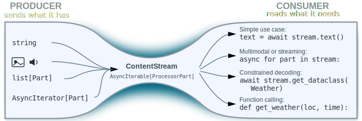

### GenAI Processors design principles

## Reduce fragmentation

The field of agents and LLMs is moving quickly, leading to many ideas maturing
independently. This has resulted in a proliferation of narrowly scoped APIs and
frameworks. While these solutions are often well-suited for their specific
tasks, they create friction at their boundaries, hinder knowledge sharing with
ad-hoc solutions, and lead to the same problems being solved repeatedly. The
fragmentation happens in multiple dimensions:

*   **Disparate APIs**: Different components (models, agents, tools) have their
    own APIs. The lack of a common language makes it difficult to interchange or
    compose them, especially since their goals and capabilities are often
    overlapping.
*   **Content types**: The ease of working with text means that multimodality is
    often an afterthought, with custom and sub-optimal solutions being built on
    a case-by-case basis. In particular, control tokens are often represented as
    text rather than as a separate modality, which makes systems much more
    vulnerable to prompt injections.
*   **Execution models**: Synchronous, streaming, and real-time execution are
    often treated as separate domains, which prevents code and knowledge reuse
    and leads to the same code rewritten in as many variants as execution modes.

This fragmentation feels even more artificial now that the line between LLMs and
tools is blurring. Originally, tools were built to give LLMs access to a world
of existing, strongly-typed endpoints (like JSON RPCs). This created a clear
split: models handled free-form prompts, while tools required strict function
signatures.

Today, that separation is breaking down. "LLM-native" tools are now often backed
by models themselves, allowing them to process free-form input directly. At the
same time, techniques like constrained decoding allow forcing models to produce
strictly structured, type-safe outputs. In this new landscape, the distinction
between a schema-less model and a strongly-typed tool is quickly disappearing.

<details markdown>
<summary>The Shift in Practice: Where Rigid APIs Fall Short</summary>

Here is how that tension manifests in real-world scenarios:

*   **Models acting as tools:** Can a lightweight model like gemini-flash-lite
    use gemini-pro as a tool to solve complex reasoning? If so, can that "tool"
    recursively make its own tool calls or pause to ask the user for
    clarification?

*   **Multi-modal tool interfaces:** Can a multimodal model like
    [Nano Banana be plugged as a tool](https://github.com/google-gemini/genai-processors/tree/main/examples/widgets)?
    Can its instructions include images?

*   **Balanced Infrastructure:** Since most users only need a simple "string-in,
    string-out" API, how do we build a foundation that supports basic users
    without limiting advanced developers? Can one architecture effectively cater
    to both?

</details>

This fragmentation is not inevitable. It is the result of how systems naturally
evolved along the path of least resistance. We propose an approach based on
three core pillars that actually remove these constraints, or at least reduce
them drastically:"

We believe that by choosing the right abstractions, many of these traditional
boundaries evaporate. Our approach focuses on three core pillars:

*   **Unified content model** - We use a single, consistent representation for
    inputs and outputs across models, agents, and tools. This way they can
    interact with each other. A unified model doesn't necessarily mean a lack of
    typing and structure. Just as JSON can have a schema (while Protobuf can be
    used through introspection without a .proto definition), content can remain
    structured while being universally readable across the ecosystem.
*   **Processors** - at the core are just functions that consume and produce
    content. We don't need to reinvent a new language for control flow; we use
    Python. Think of the difference between PyTorch/JAX and the original
    TensorFlow. While TensorFlow often felt like its own separate language you
    had to learn, PyTorch and JAX integrate natively with Python. We aim for
    that same "idiomatic" feel where the AI framework disappears into the code.
*   **Streaming** - should be a capability, not a constraint. The system is
    designed so that each processor decides independently how it consumes and
    produces the content. The infrastructure adjusts the plumbing accordingly.

## Managing the complexity

For us, complexity is primarily defined by **how hard it is to understand the
agent's code**. Our goal is to provide an API that encapsulates this complexity.
**The agent shouldn't pay for what it doesn't use, but when it needs something,
the plumbing should be there**.

By delegating the heavy lifting to native Python and `asyncio`, we ensure our
framework feels like an extension of existing Python logic, not a hurdle. On top
of this foundation, we’ve added our 'secret sauce': the Hourglass Architecture,
a universal adapter for flowing data in and out of any model:

*   Producer yields Content in whatever form is most convenient: just a string,
    list of multimodal Parts, AsyncIterator...
*   It is reduced to a uniform stream of `ProcessorPart`. This is our "fixed
    point" that ensures compatibility across the entire system.
*   Consumer declares what it needs and the stream is narrowed down to that,
    with checks. Need a plain-text answer? Use `await stream.text()`. Handling
    multimodal data or a stream? Use `async for part in stream:`. For Tools
    (which are just Python functions), the function signature itself acts as the
    declaration.

<p align="center">
  
</p>

This works because LLMs act as a design anchor: content circulating through the
system will go to or be produced by them, likely multiple times and at different
levels. Since models naturally process weakly typed, multimodal data, sticking
to a flexible format ensures we remain compatible with the broader AI ecosystem.

However, this flexibility is a strategic trade-of: working with weakly typed
data is harder. Rather than attempting to eliminate that inherent complexity —
which usually just causes it to resurface as fragmentation elsewhere — we keep
it in check by encapsulating it within a robust, shared library covered by
exhaustive tests.

Many other APIs prioritize avoiding client-side libraries to simplify
cross-language support. We believe the 'fragmentation tax' of that approach is
too high; for us, the investment in a unified library is a price worth paying to
maintain both flexibility and system consistency.

## Unified content model

For an ecosystem to communicate effortlessly, every component — models, agents,
and tools — must speak the same language. GenAI Processors adopt the core
content representation of the
[Gemini API](https://ai.google.dev/gemini-api/docs), but wrap it in convenience
classes to provide essential "syntax sugar".

Notably, our
[Content API](https://github.com/google-gemini/genai-processors/blob/main/genai_processors/content_api.py)
is modular; it provides value as a standalone library and can be used
**independently** of the broader Processors framework.

We had to make a couple of deviations from the vanilla Gemini API, though:

*   **Syntax sugar**: `ProcessorPart` / `ProcessorContent` are constructible
    from many types used to represent content. Following our "producer can yield
    whatever multimodal data it has and we will sort it out" principle, if an
    agent needs to say `"Hello world!"` then `"Hello world!"` is what you type,
    there is no need to wrap it in `types.Part.from_text(text="Hello world!")`.
    We’ve also added built-in accessors that safely narrow content to a specific
    modality (text, image, etc.) with integrated validation.
*   **Flat Content**: In traditional APIs, turns are nested within separate
    objects. While intuitive, this structure breaks during real-time streaming.
    We’ve moved the `role` property directly to the `Part` level. This "flat"
    architecture ensures that every chunk of data in a stream is
    self-describing. Note that content returned by turn-based models is still a
    single turn.
*   **Extensibility**: The Gemini API is built for Gemini models, but agents
    often need to pass custom metadata or unique data structures (like Python
    dataclasses). This should not require changing the API. Rather than
    reinventing the wheel, we took inspiration from the tech stack on which the
    Internet has been running for decades, in particular multipart/mixed defined
    in [RFC 1341](https://datatracker.ietf.org/doc/html/rfc1341) from 1992.

## Streaming: responsiveness without complexity

When prototyping a new agent or exploring a fresh idea, simplicity is king.
Synchronous, text-only APIs are the easiest starting point. However, models take
time to respond, tools make RPC calls, multi-agent systems grow complex while
the user wants a responsive UI. Streaming is the key to that UX, but it often
feels like a heavy architectural burden. **How do we make the transition to
streaming painless when the time is right?**

First of all, allow each component to independently decide whether it wants to
stream or not. On the interface level, we always use multimodal content streams.
But this doesn't add much complexity: writing `await prompt.text()` is not much
harder than writing `prompt`.

The second key observation is that code designed to handle multimodal content
naturally fits a streaming pattern. By using the `async for part in content:`
syntax, the same logic works whether the data arrives all at once or bit-by-bit.
This approach keeps your code clean and linear, completely avoiding the
"callback hell" often associated with asynchronous event handling.

To further simplify the code we wrap our streams in the
[`ContentStream`](https://github.com/google-gemini/genai-processors/blob/main/genai_processors/content_api.py#:~:text=class%20ContentStream)
mixin instead of using plain `AsyncIterable[ProcessorPart]`. This mixin provides
the "syntax sugar" to any kind of `ProcessorContentTypes` or `AsyncIterator` of
such. Importantly, this stream doesn't even have to originate from a Processor;
it's a universal utility for the entire ecosystem.

## Processors

At a high level, models, agents, and tools are just transformations of content.
Instead of inventing a proprietary framework for defining these transformations,
we rely on time-proven and well-known tools: Python and Asyncio. These provide
the robust, native runtime your agents need.

We call these functional blocks Processors (to avoid confusion with the
"Transformer" neural network architecture). In the very first version of the
library they were regular async Python functions. But then we realized that by
following a specific implementation pattern, we can make code much simpler and
unlock advanced optimizations and introspection.

### The dual-interface pattern

A Processor needs to balance two different needs: it must be easy to call (for
the user) and easy to implement (for the developer). We achieve this by
splitting the interface:

```python
class MyProcessor(Processor):
  # The CONSUMER Interface:
  # Designed for the caller. It is permissive with inputs and
  # provides a rich, "sugared" stream as the output.
  @typing.final
  def __call__(
      self, content: AsyncIterable[ProcessorPartTypes]
  ) -> ProcessorStream:
    ...

  # The PRODUCER Interface:
  # Designed for the author. It provides a concrete, structured
  # input while allowing the author to yield content in whatever
  # raw format is most convenient.
  @abc.abstractmethod
  async def call(
      self, content: ProcessorStream
  ) -> AsyncIterable[ProcessorPartTypes]:

```

This "Asymmetric Interface" acknowledges that producers and consumers have
different priorities: the Consumer wants ease of use, the Producer wants ease of
creation. In addition, by placing a library-owned interposer between these two
interfaces, we gain powerful capabilities without complicating your code. For
example, it
[allows introspecting](https://github.com/google-gemini/genai-processors/tree/main/genai_processors/dev)
the processor chain for debugging, logging, and performance monitoring.

## What it means in practice

**Simple and natural code that scales with your requirements.** You can start
with the absolute basics and add complexity only when you need it. If you need a
quick answer from a model, it’s a one-liner:

```python
model = genai_models.genaiModel(...)
print(
    await model('Answer to the Ultimate Question of Life, the Universe, and Everything').text()
)
```

If we were to expect the answer to actually be a bit longer and were anxious to
learn the wisdom, we probably would have written

```python
async for part in model('Answer to...'):
  print(part.text, end='')
```

To add more functionality while keeping the code structured, processors can be
chained using `+`. For instance, if the model doesn't have native audio support,
we can prepend a speech-to-text stage and a microphone input:

```python
from genai_processors.core import audio_io
from genai_processors.core import speech_to_text

agent = audio_io.PyAudioIn(pyaudio.PyAudio()) + speech_to_text.SpeechToText(...) + model
```

And if we need to move beyond linear chains, we can use good old Python control
flow. For instance, let's squeeze some extra quality by using a critic-reviser
pattern:

```python
class CriticReviser(processor.Processor):
  """Agent that uses a critic-reviser loop to improve responses."""

  def __init__(self, model: processor.Processor, max_iterations: int = 5):
    self._model = model
    self._max_iterations = max_iterations

  async def call(
      self, content: content_api.ContentStream
  ) -> AsyncIterable[content_api.ProcessorPartTypes]:
    # We gather content from the stream as we will need to reuse it multiple times.
    input_content = await content.gather()

    current_response = await self._model(input_content).gather()

    for _ in range(self._max_iterations):
      critic_response = await self._model([
          input_content,
          '\n\nDraft response:\n\n',
          current_response,
          (
              '\n\nYou are a harsh critic. Review the draft response to the'
              " user's prompt. If the draft fully answers the prompt and has no"
              " obvious flaws, simply output 'OK'. Otherwise, concisely list"
              ' the flaws or missing information. Do not rewrite the response.'
          ),
      ]).gather()

      critic_text = await critic_response.text(strict=False)
      if critic_text.strip().upper() == 'OK':
        break

      current_response = await self._model([
          input_content,
          '\n\nDraft response:\n\n',
          current_response,
          '\n\nCriticism:\n',
          critic_response,
          (
              '\n\nUpdate your previous draft response to address the'
              ' criticism. Keep the parts that are already good.'
          ),
      ]).gather()

    for part in current_response:
      yield part
```

## Conclusion

> I didn't have time to write a short letter, so I wrote a long one instead.
>
> ― Mark Twain

If left unchecked, building AI applications inevitably turns into an exercise in
wrangling complex, disjointed APIs. You end up writing the "long letter"—bloated
glue code simply to get agents, models, tools, and UIs to communicate.

By adopting a unified content model, leaning into Python's native `asyncio`, and
decoupling the Producer and Consumer interfaces, GenAI Processors handles the
structural complexity for you. We make writing the "short letters" easier: a
cohesive framework where you don't pay for the plumbing you don't use, but it's
always there when you need it. Let's make building agents simple again.
